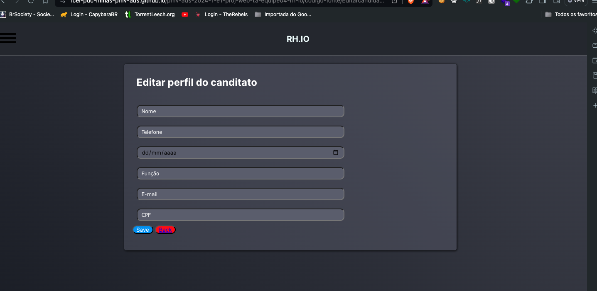
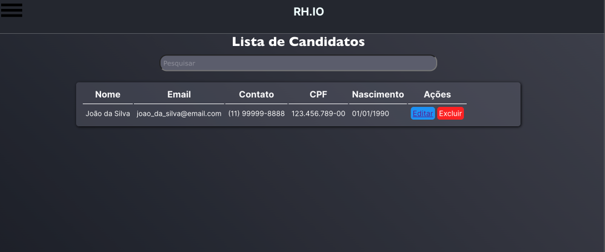

# Programação de Funcionalidades
 

### Tela de Login (RF-002)  
### Tela de Cadastro (RF-001)

Responsável: **Rayssa**

O acesso a tela de login e  cadastro, o cadastro poderá ser feito através da seta a baixo de  “Cadastre-se”. As estruturas de dados foram baseadas em HTML, CSS e JS.

Exemplo da tela de login:  

Exemplo da tela de cadastro:  

#### Requisito atendido
RF-001: O site deve permitir ao usuário cadastrar uma conta.  
RF-002: O site deve permitir ao usuário efetuar login na conta.

#### Artefatos da funcionalidade

login.html
login.css
login.js

#### Estrutura de Dados

[login.html](../codigo-fonte/login.html)

#### Instruções de acesso
Abra um navegador de Internet e informe a seguinte URL: [https://icei-puc-minas-pmv-ads.github.io/pmv-ads-2024-1-e1-proj-web-t3-equipe04-rh-io/codigo-fonte/login.html](https://icei-puc-minas-pmv-ads.github.io/pmv-ads-2024-1-e1-proj-web-t3-equipe04-rh-io/codigo-fonte/login.html)

  

### Tela de cadastro de vagas (RF-11)  

Responsável: **Hudson**

O acesso a pagina e acessivel no menu hamburguer no canto superior esquerdo nos link **Solicitações de funcionario** e **Nova solicitação**. As estruturas de dados foram baseadas em HTML, CSS e JS.

Exemplo da tela de cadastro:  

Exemplo da tela de visualização de vagas:  

#### Requisito atendido
**RF-11**: O aplicação exibi um quadro de solicitações de funcionarios para determinados setores  

#### Artefatos da funcionalidade

solicitacao-de-funcionario.html 
solicitacao_de_funcionario.css 

nova-solicitacao.html 
nova-solicitacao.css 

solicitacao_de_funcionario.js 
nova-solicitacao.js 
header.js

#### Estrutura de Dados

[solicitacao-de-funcionario.html](../codigo-fonte/solicitacao-de-funcionario.html)  
[nova-solicitacao.html](../codigo-fonte/nova-solicitacao.html)

#### Instruções de acesso
Abra um navegador de Internet e informe a seguinte URL (Tela de cadastro de vagas): [https://icei-puc-minas-pmv-ads.github.io/pmv-ads-2024-1-e1-proj-web-t3-equipe04-rh-io/codigo-fonte/nova-solicitacao.html](https://icei-puc-minas-pmv-ads.github.io/pmv-ads-2024-1-e1-proj-web-t3-equipe04-rh-io/codigo-fonte/nova-solicitacao.html) 
Abra um navegador de Internet e informe a seguinte URL (Tela de visualização de vagas): [https://icei-puc-minas-pmv-ads.github.io/pmv-ads-2024-1-e1-proj-web-t3-equipe04-rh-io/codigo-fonte/solicitacao-de-funcionario.html](https://icei-puc-minas-pmv-ads.github.io/pmv-ads-2024-1-e1-proj-web-t3-equipe04-rh-io/codigo-fonte/solicitacao-de-funcionario.html)

  

### Tela de cadastro de candidatos (RF-06)  
### Tela inicial

Responsável: **Fernando**

Tela inicial com informações e imagens relacionadas ao tema e uma página de cadastro de candidatos as vagas determinadas.
 “Cadastro de candidatos” e “RH.IO”. As estruturas de dados foram baseadas em HTML, CSS e JS.

Exemplo da tela de index:  

Exemplo da tela de cadastro de candidato:  

#### Requisito atendido
RF-006: A aplicação deve possibilitar ao usuário efetuar o registro de colaboradores.  

#### Artefatos da funcionalidade

Cadastro-cadidate.html
aaa.css
styles.css
index.html
inicio.css

#### Estrutura de Dados

[cadastro-cadidate.html](../codigo-fonte/cadastro-cadidate.html)

#### Instruções de acesso
Abra um navegador de Internet e informe a seguinte URL: [https://icei-puc-minas-pmv-ads.github.io/pmv-ads-2024-1-e1-proj-web-t3-equipe04-rh-io/codigo-fonte/cadastro-cadidate.html](https://icei-puc-minas-pmv-ads.github.io/pmv-ads-2024-1-e1-proj-web-t3-equipe04-rh-io/codigo-fonte/cadastro-cadidate.html)   

[https://icei-puc-minas-pmv-ads.github.io/pmv-ads-2024-1-e1-proj-web-t3-equipe04-rh-io/codigo-fonte/](https://icei-puc-minas-pmv-ads.github.io/pmv-ads-2024-1-e1-proj-web-t3-equipe04-rh-io/codigo-fonte/)

  

### Edição de candidatos(RF 07 e RF 08)

Responsável: **Davi de Assis Vilela**

Essa é a tela de edição de candidatos, onde pode-se consultar, editar e adicionar informações aos dados dos candidatos já cadastrados.

exemplo da tela de edição de candidatos:  

#### Requisito atendido

Aqui os dados dos candidatos podem ser editados em casos especiais como mudança de endereço, telefone etc.
- RF 07 - de verificação de dados do candidato.
- RF 08 - de adicionar documentos ao perfil do candidato.

#### Artefatos da funcionalidade

Os aquios referentes a funcionalidade "Editar Candidato" são: 

EditarcanditadoDavi.html  
edituser.css  
db.js

#### Estrutura de Dados
[EditarcanditadoDavi.html](../codigo-fonte/EditarcanditadoDavi.html)

#### Instruções de acesso
 Abra um navegador de Internet e informe a seguinte URL (Editar candidatos): [https://icei-puc-minas-pmv-ads.github.io/pmv-ads-2024-1-e1-proj-web-t3-equipe04-rh-io/codigo-fonte/EditarcandidatoDavi.html](https://icei-puc-minas-pmv-ads.github.io/pmv-ads-2024-1-e1-proj-web-t3-equipe04-rh-io/codigo-fonte/EditarcandidatoDavi.html)

 

  

### Banco de Dados(RF 03 e RF 04)

Responsável: **Davi de Assis Vilela**

Essa é a tela de banco de dados, onde todos os dados dos candidatos já cadastrados são armazenados, podendo serem consultados a qualquer momento.

exemplo da tela de listagem de usuario:  

#### Requisito atendido

Aqui todos os dados adquiridos do candidatos serão salvos e armazenados. Os dados podem ser editados ou apagardos ao serem acessados.
 - RF 03 - de barra de pesquisa, que é usada para localizar com precisaão o nome de um candidatos.
 - RF 04 - de criar marcadores individuais para a classificação do candidato. 

#### Artefatos da funcionalidade

Os arquivos referentes  "banco de dados" são:

bancodados.html
bancodados.css
davi.js
db.js

#### Estrutura de Dados
[bancodados.html](../codigo-fonte/bancodados.html)

#### Instruções de acesso
 Abra um navegador de Internet e informe a seguinte URL (Banco de Dados): [https://icei-puc-minas-pmv-ads.github.io/pmv-ads-2024-1-e1-proj-web-t3-equipe04-rh-io/codigo-fonte/bancodados.html](https://icei-puc-minas-pmv-ads.github.io/pmv-ads-2024-1-e1-proj-web-t3-equipe04-rh-io/codigo-fonte/bancodados.html)