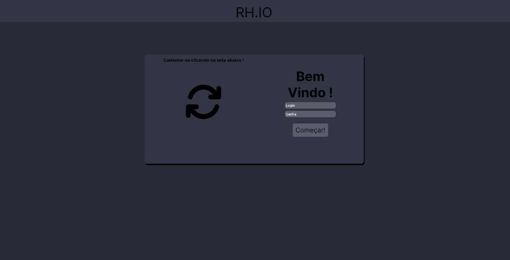
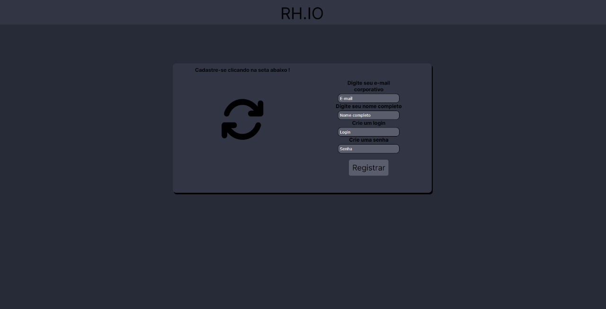
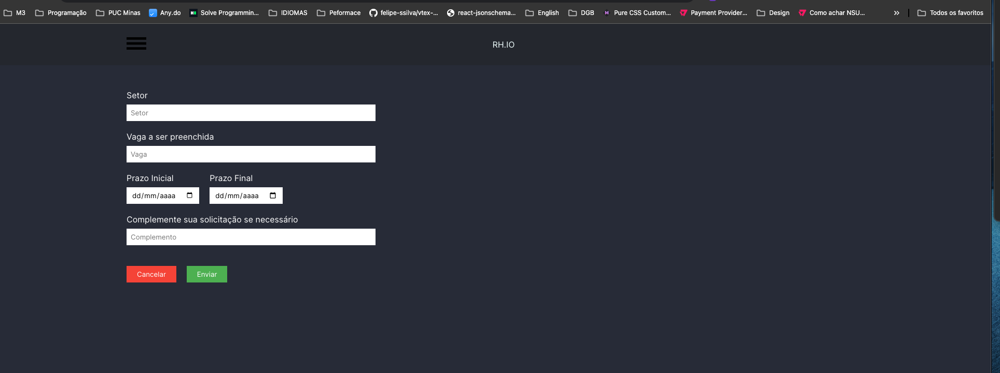
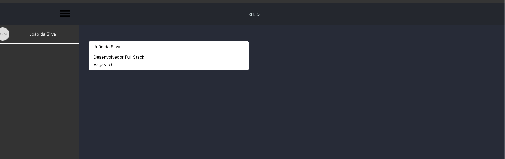
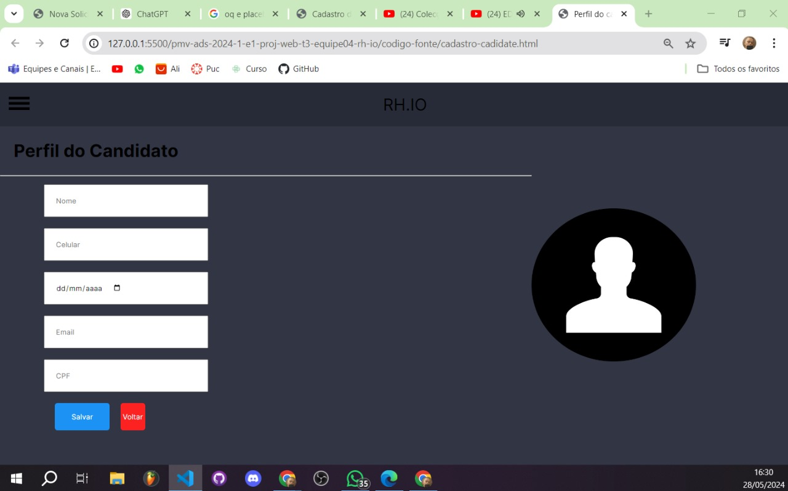

# Programação de Funcionalidades
 

### Tela de Login (RF-002)  
### Tela de Cadastro (RF-001)

Responsável: Rayssa

O acesso a tela de login e  cadastro, o cadastro poderá ser feito através da seta a baixo de  “Cadastre-se”. As estruturas de dados foram baseadas em HTML, CSS e JS.

Exemplo da tela de login:  

Exemplo da tela de cadastro:  

#### Requisito atendido
RF-001: O site deve permitir ao usuário cadastrar uma conta.  
RF-002: O site deve permitir ao usuário efetuar login na conta.

#### Artefatos da funcionalidade

login.html
login.css
login.js

#### Estrutura de Dados

[login.html](../codigo-fonte/login.html)

#### Instruções de acesso
Abra um navegador de Internet e informe a seguinte URL: [https://icei-puc-minas-pmv-ads.github.io/pmv-ads-2024-1-e1-proj-web-t3-equipe04-rh-io/codigo-fonte/login.html](https://icei-puc-minas-pmv-ads.github.io/pmv-ads-2024-1-e1-proj-web-t3-equipe04-rh-io/codigo-fonte/login.html)

  

### Tela de cadastro de vagas (RF-11)  

Responsável: Hudson

O acesso a pagina e acessivel no menu hamburguer no canto superior esquerdo nos link **Solicitações de funcionario** e **Nova solicitação**. As estruturas de dados foram baseadas em HTML, CSS e JS.

Exemplo da tela de cadastro:  

Exemplo da tela de visualização de vagas:  

#### Requisito atendido
**RF-11**: O aplicação exibi um quadro de solicitações de funcionarios para determinados setores  

#### Artefatos da funcionalidade

solicitacao-de-funcionario.html 
solicitacao_de_funcionario.css 

nova-solicitacao.html 
nova-solicitacao.css 

solicitacao_de_funcionario.js 
nova-solicitacao.js 
header.js

#### Estrutura de Dados

[solicitacao-de-funcionario.html](../codigo-fonte/solicitacao-de-funcionario.html)  
[nova-solicitacao.html](../codigo-fonte/nova-solicitacao.html)

#### Instruções de acesso
Abra um navegador de Internet e informe a seguinte URL (Tela de cadastro de vagas): [https://icei-puc-minas-pmv-ads.github.io/pmv-ads-2024-1-e1-proj-web-t3-equipe04-rh-io/codigo-fonte/nova-solicitacao.html](https://icei-puc-minas-pmv-ads.github.io/pmv-ads-2024-1-e1-proj-web-t3-equipe04-rh-io/codigo-fonte/nova-solicitacao.html) 
Abra um navegador de Internet e informe a seguinte URL (Tela de visualização de vagas): [https://icei-puc-minas-pmv-ads.github.io/pmv-ads-2024-1-e1-proj-web-t3-equipe04-rh-io/codigo-fonte/solicitacao-de-funcionario.html](https://icei-puc-minas-pmv-ads.github.io/pmv-ads-2024-1-e1-proj-web-t3-equipe04-rh-io/codigo-fonte/solicitacao-de-funcionario.html)

  

### Tela de cadastro de candidatos (RF-06)  
### Tela inicial

Responsável: Fernando 

Tela inicial com informações e imagens relacionadas ao tema e uma página de cadastro de candidatos as vagas determinadas.
 “Cadastro de candidatos” e “RH.IO”. As estruturas de dados foram baseadas em HTML, CSS e JS.

Exemplo da tela de index:  

Exemplo da tela de cadastro de candidato:  

#### Requisito atendido
RF-006: A aplicação deve possibilitar ao usuário efetuar o registro de colaboradores.  

#### Artefatos da funcionalidade

Cadastro-cadidate.html
aaa.css
styles.css
index.html
inicio.css

#### Estrutura de Dados

[cadastro-cadidate.html](../codigo-fonte/cadastro-cadidate.html)

#### Instruções de acesso
Abra um navegador de Internet e informe a seguinte URL: [https://icei-puc-minas-pmv-ads.github.io/pmv-ads-2024-1-e1-proj-web-t3-equipe04-rh-io/codigo-fonte/cadastro-cadidate.html](https://icei-puc-minas-pmv-ads.github.io/pmv-ads-2024-1-e1-proj-web-t3-equipe04-rh-io/codigo-fonte/cadastro-cadidate.html)   

[https://icei-puc-minas-pmv-ads.github.io/pmv-ads-2024-1-e1-proj-web-t3-equipe04-rh-io/codigo-fonte/](https://icei-puc-minas-pmv-ads.github.io/pmv-ads-2024-1-e1-proj-web-t3-equipe04-rh-io/codigo-fonte/)

