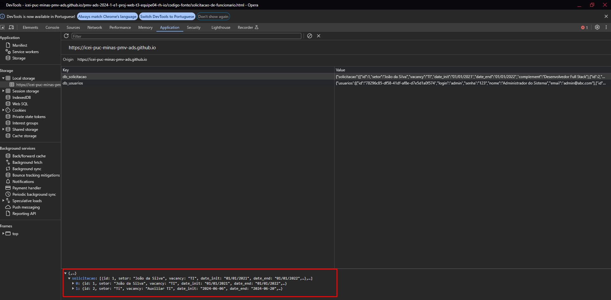

# Registro de Testes de Software

Os testes funcionais realizados na aplicação web são descritos a seguir.

<ol>
    <li> 
        CT-01: Verificar o funcionamento dos links da página Home. 
        
 
            
Responsável: Hudson.

             
            
Testando se e possivel fazer login.

            
             
            
Testando se da error se nao adicionar o email ou a senha

            
        

    </li>
     
    

     
    <li> 
         CT-02:Verificar o funcionamento da tela de cadastro 
        
 
            
Responsável: Hudson.

             
            
Testando se e possivel fazer o cadastro

            
             
            
Testando se da error se deixar algum campo vazio

            
        

    </li>
     
    

     
    <li> 
         CT. 03:Verificar o funcionamento da tela de cadastro de vagas 
        
 
            
Responsável: Rayssa.

             
            
Informações armazenadas no LocalStorage após usuário realizar a solicitação. 

            
              
            
O usuário completa os campos e clica em enviar para solicitar funcionários para as vagas especificadas. 

            
             
            
Usuário não preenche todos os campos solicitados: 

            
        

    </li>
     
    

     
    <li> 
         CT-07: Verificar o funcionamento da tela de cadastro de novos candidatos. 
        
 
            
Responsável: DAVI.

             
            
criando perfil de candidato 

            <a href="https://www.youtube.com/embed/LuzyHalS6iI?si=J3mfPwhRUl6HxX77" target="_blank">https://www.youtube.com/embed/LuzyHalS6iI?si=J3mfPwhRUl6HxX77</a>
        

    </li>
     
    

     
    <li> 
         CT-08: Verificar o funcionamento da tela de início. 
        
 
            
Responsável: DAVI.

             
            
Testando tela de inicio 

             <a href="https://www.youtube.com/embed/EJu7t89jxkw?si=xScXOhNQsczmcZoO" target="_blank">https://www.youtube.com/embed/EJu7t89jxkw?si=xScXOhNQsczmcZoO</a>
        

    </li>
       
    

     
    <li> 
        CT-06: Verificar funcionamento da funcionalidade de banco de dados. 
        
 
            
Responsável: Fernando.

             
            
testando funcionalidade banco de dados

             <a href="https://www.youtube.com/watch?v=Xr_ZuEsQQfk" target="_blank">https://www.youtube.com/watch?v=Xr_ZuEsQQfk</a>
        

    </li>
</ol>

